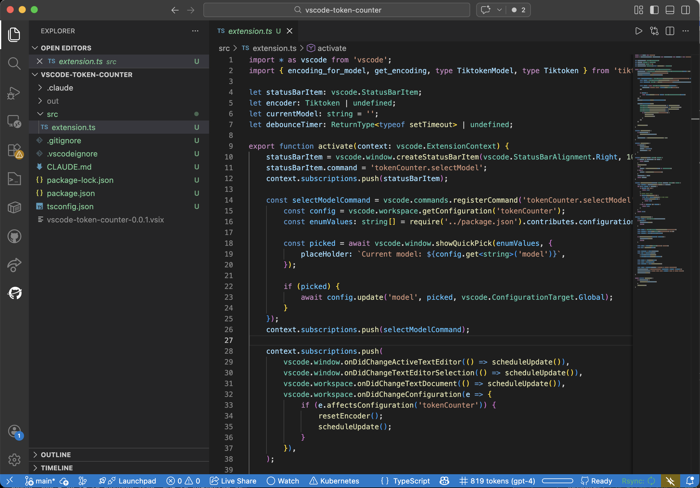
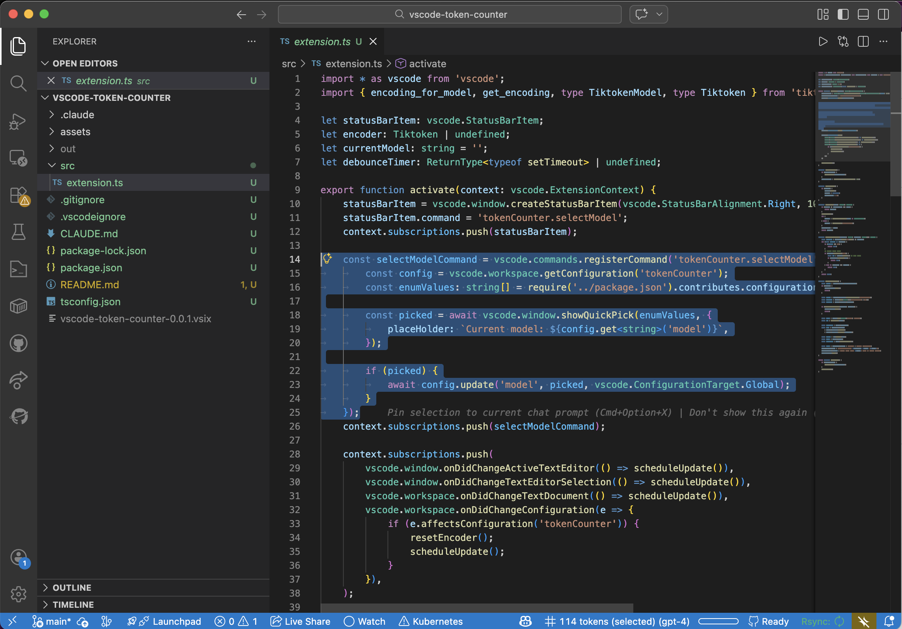

# Token Meter for VS Code

A VS Code extension that counts tokens in the current file or selected text.

Token count is displayed in the status bar and updates in real-time as you type or change selection.



Count token in the selected code:



## 🎨 Features

- Token count for the entire file or selected text
- Real-time updates with debouncing
- Configurable model for tokenization
- File pattern filtering to control which files show token counts
- Click the status bar item to quickly switch models

## ⚙️ Settings

| Setting                   | Default   | Description                                                                                                                                                                                |
| ------------------------- | --------- | ------------------------------------------------------------------------------------------------------------------------------------------------------------------------------------------ |
| `tokenMeter.model`        | `gpt-4o`  | Model to use for token counting. Supported: `gpt-4o`, `gpt-4o-mini`, `gpt-4-turbo`, `gpt-4`, `gpt-3.5-turbo`, `text-embedding-3-small`, `text-embedding-3-large`, `text-embedding-ada-002` |
| `tokenMeter.filePatterns` | See below | Glob patterns for files to count tokens in. Use `["*"]` to match all files.                                                                                                                |

Default file patterns:

```json
["*.md", "*.txt", "*.py", "*.js", "*.jsx", "*.ts", "*.tsx", "*.json", "*.yaml", "*.yml", "*.toml", "*.xml", "*.html", "*.css", "*.scss", "*.less", "*.go", "*.rs", "*.java", "*.kt", "*.scala", "*.c", "*.cpp", "*.h", "*.hpp", "*.cs", "*.rb", "*.php", "*.swift", "*.m", "*.r", "*.R", "*.lua", "*.pl", "*.sh", "*.bash", "*.zsh", "*.fish", "*.sql", "*.graphql", "*.proto", "*.dart", "*.ex", "*.exs", "*.erl", "*.hs", "*.clj", "*.vue", "*.svelte", "*.tf", "*.dockerfile", "Dockerfile"]
```

or:

```json
["*"]
```

## 🤝 Contributing

- Ping me on Twitter [@samuelberthe](https://twitter.com/samuelberthe) (DMs, mentions, whatever :))
- Fork the [project](https://github.com/samber/vscode-token-meter)
- Fix [open issues](https://github.com/samber/vscode-token-meter/issues) or request new features

Don't hesitate ;)

```bash
npm install -g @vscode/vsce
vsce package
code --install-extension vscode-token-meter-*.vsix 
```

Press **F5** in VS Code to launch the Extension Development Host.

## 👤 Contributors


## 💫 Show your support

Give a ⭐️ if this project helped you!

[](https://github.com/sponsors/samber)

## 📝 License

Copyright © 2022 [Samuel Berthe](https://github.com/samber).

This project is under [MIT](./LICENSE) license.